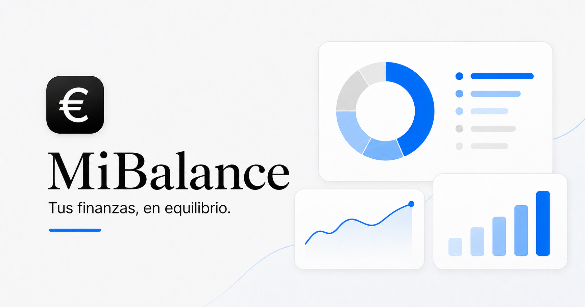

# MiBalance



Una aplicación web local-first para importar y clasificar automáticamente tus movimientos de Ibercaja. Obtén un resumen anual de tus gastos para descubrir dónde gastas más, identificar tus mayores gastos y conocer cuáles son recurrentes, acompañado de un resumen de IA sobre tu actividad financiera anual.

## Qué ofrece

- Importación de archivos XLSX y CSV de Ibercaja.
- Tabla con fecha de operación, fecha valor, concepto, descripción, referencia e importe.
- Clasificación automática mediante reglas editables desde la interfaz.
- Detección y exclusión de movimientos duplicados.
- Resumen anual de ingresos, gastos y balance.
- Evolución mensual y distribución por categorías.
- Top 20 de comercios y pagos recurrentes.
- Tasa de ahorro basada en las transferencias enviadas al banco de inversión.
- Filtros de movimientos conectados con los paneles del resumen.
- Almacenamiento exclusivo en el navegador mediante `localStorage`.

## Privacidad

Los archivos se procesan en el navegador. Los movimientos y las reglas se guardan localmente en el dispositivo y no se envían a servicios externos.

## Desarrollo local

Requiere Node.js 22.

```bash
npm install
npm run dev
```

La aplicación estará disponible en [http://localhost:3000](http://localhost:3000).

## Validación

```bash
npm test
npm run lint
npm run build
```

## Archivo de ejemplo

El repositorio incluye un CSV ficticio de Ibercaja en [`public/ejemplo-ibercaja.csv`](public/ejemplo-ibercaja.csv) para probar el flujo de importación sin utilizar información bancaria real.

## Tecnología

- Next.js 16 y React 19.
- TypeScript.
- Bricolage Grotesque y Roboto Mono.
- Procesamiento local de XLSX y CSV.
- Persistencia mediante `LocalDataStore`, preparada para sustituirse por otra capa en el futuro.

## Conexiones bancarias futuras

Una conexión bancaria real requeriría un proveedor AISP autorizado con cobertura de Ibercaja, OAuth/SCA, almacenamiento cifrado de tokens en servidor y revisión legal PSD2/RGPD. MiBalance no solicita credenciales bancarias ni utiliza scraping.

## Licencia

Este proyecto se distribuye bajo la [licencia MIT](LICENSE).
